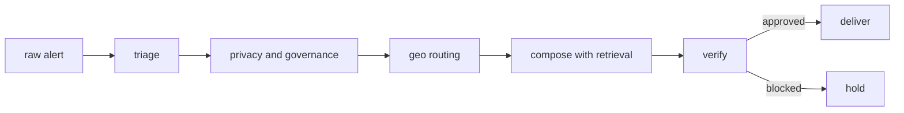
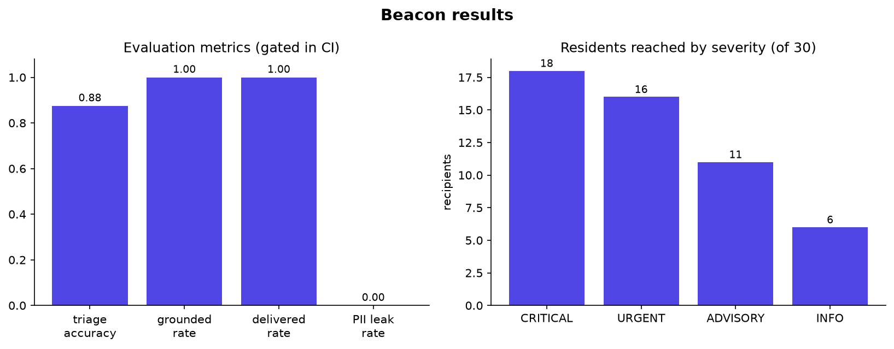

# Beacon

[](https://github.com/SpowZy/beacon/actions/workflows/ci.yml)
[](https://www.python.org)
[](LICENSE)

A privacy first agentic router for hyperlocal community alerts.

Beacon takes a raw local alert, triages it, strips every personal identifier,
routes it by geography to the right residents, and verifies the result before
anything is delivered. It is a small, readable model of the AI layer a community
safety product needs: simple, consistent, and trustworthy.

It runs from a clean clone with no API key, no downloaded model, and no network.
The default language backend is a deterministic mock, so the whole pipeline is
reproducible and free. Flip one environment variable to run the same code on a
local Ollama model or on Claude.

## Pipeline



Each step is an agent with one responsibility, orchestrated as a typed LangGraph
state graph. The conditional edge after verify decides delivery or hold.

## Results



Left: evaluation metrics on a labelled set, gated in CI. The PII leak rate is
zero by construction, because the privacy agent runs before anything is composed
and the verifier blocks any message that still carries an identifier. Right: the
severity scaled routing radius, so a critical alert reaches a wider ring of
residents than an advisory.

## Quickstart

```
python -m venv .venv
.venv\Scripts\activate
pip install -e ".[dev]"
python -m beacon.demo
```

No key is needed. Run the tests with `pytest -q` and the evaluation with
`python -m beacon.eval`.

Use a real local model (free, after `ollama pull llama3.2`):

```
set BEACON_LLM_BACKEND=ollama
python -m beacon.demo
```

Use Claude:

```
set BEACON_LLM_BACKEND=anthropic
set BEACON_ANTHROPIC_API_KEY=your_key
python -m beacon.demo
```

## Why this design

- Agentic orchestration with LangGraph: a typed state graph with a conditional
  trust gate, not a single prompt.
- Privacy as a first class agent: alerts are classified P2 (community level, no
  PII) and scrubbed before they move. A differential privacy helper covers
  community level aggregates, the shape of a privacy preserving B2B data product.
- A verification gate carried over from evaluating frontier models: a confident
  wrong message is the real risk in a safety product, so it is blocked.
- Pluggable models: mock, a local small model via Ollama, or Claude. That is LLM
  and SLM orchestration in practice.

## Synthetic by design

The data in `beacon/synth.py` is fake and clearly labelled. Synthetic data keeps
the demo a one command clone and run, with full control over edge cases such as a
critical alert that carries personal details. The same interfaces accept real
open data, so swapping in a government open data feed is a local change.

## Service

```
pip install -e ".[api]"
uvicorn beacon.api:app --reload
```

POST /alert runs the pipeline. GET /community/{suburb}/insight returns a
differentially private community aggregate.

## Regenerate the results figure

```
pip install -e ".[viz]"
python -m beacon.plots
```

More detail and the references are in `docs/architecture.md`.

## License

MIT, see [LICENSE](LICENSE).
